| 一 | 二 | 三  | 四 |
|:--:|:--:|:--:|:--:|
|[CV算法](#CV)|[搜索广告推荐算法](#SearchAdvertiseRecommend)|[计算机基础](#BasicComputerKnowledge)|[编程基础](#BasicProgrammingKnowledge)

<h2 id="CV"></h2>

* **CV算法**
    * [为什么引入非线性激活函数](#为什么引入非线性激活函数)
    * [为什么使用ReLU激活函数](#为什么使用ReLU激活函数)
    * [权重初始化](#权重初始化)
    * [Unet网络和Vnet网络的区别](#Unet网络和Vnet网络的区别)
    * [简述CNN和FCN的区别](#简述CNN和FCN的区别)
    * [解释随机梯度下降SGD](#解释随机梯度下降SGD)
    * [正则化的意义](#正则化的意义)
    * [减少过拟合的方法](#减少过拟合的方法)
    * [解释最大似然估计和最小二乘法](#解释最大似然估计和最小二乘法) ---imp
    * [输入数据归一化的原因](#输入数据归一化的原因)
    * [图像分割需要处理类别不平衡吗](#图像分割需要处理类别不平衡吗)
    * [batch size](#batchsize)
    * [比较dice loss 和 cross-entropy loss，说明优缺点](#比较diceloss和cross-entropyloss说明优缺点) ---imp
    * [解释 batch normlization](#解释batchnormlization) ---imp
    * [深度网络有什么好处](#深度网络有什么好处)
    * [解释残差学习](#解释残差学习)
    * [解释dropout](#解释dropout) ---imp
    * [softmax 和 sigmoid 的关系和区别](#softmax和sigmoid的关系和区别) ---imp
    * [解释 deconvolution](#解释deconvolution) ---imp
    * [正则化](#正则化)
    * [感受野](#感受野)
    * [万能近似定理](#万能近似定理)
    * [什麽样的数据集不适合用深度学习](#什麽样的数据集不适合用深度学习) 
    * [CNN 最成功的应用是在 CV，那为什么 NLP 和 Speech 的很多问题也可以用 CNN 解出来？
为什么 AlphaGo 里也用了 CNN？这几个不相关的问题的相似性在哪里？ CNN 通过什么手段
抓住了这个共性？](#为什么NLP和Speech的很多问题也可以用CNN解出来) ---imp
    * [什么是卷积](#什么是卷积) 
    * [解释 DNN， CNN， RNN](#解释DNNCNNRNN) 
    * [depth-wise convolution 减少的计算量](#depthWiseConvolution减少的计算量) 
    * [回归任务难训练](#回归任务难训练) 
    * [lr 和 svm 的异同点](#lr和svm的异同点) 
    * [Depthwise +Pointwise 和 group 卷积的区别](#DepthwisePointwise和group卷积的区别) 
    * [分析一下分类、检测、分割需要的特征有什么区别？用在人脸检测上的卷积和图像识别
的卷积有什么区别？](#1分析一下分类检测分割需要的特征有什么区别2用在人脸检测上的卷积和图像识别的卷积有什么区别)
    * [解释 HoG 和 SIFT](#解释HoG和SIFT) 
    * [解释 RCNN， Fast-RCNN， Faster-RCNN](#解释1RCNN2FastRCNN3FasterRCNN)
    * [diceloss 和其导数](#diceloss和其导数)
    * [正则化惩罚为什么会起作用](#正则化惩罚为什么会起作用)
    * [万向节死锁](#万向节死锁)
    * [最小二乘的解析解可以用Gaussian分布以及最大似然估计求得](#最小二乘的解析解可以用Gaussian分布以及最大似然估计求得)
    * [解释densenetBlock](#解释densenetBlock)
    * [解释squeezenetBlock](#解释squeezenetBlock)
    * [解释shufflenet](#解释shufflenet)
    * [梯度消失和梯度爆炸](#梯度消失和梯度爆炸)
    * [Batchnorm为什么可以解决梯度的问题ReLU](#Batchnorm为什么可以解决梯度的问题ReLU)
    * [batchnorm的思想sigmoid](#batchnorm的思想sigmoid)
    * [MAE和MSE对比](#MAE和MSE对比) ---imp
    * [最大似然和损失函数](#最大似然和损失函数)
    * [过拟合的两种解释](#过拟合的两种解释)
    * [回归和高斯分布](#回归和高斯分布)
    * [最大似然估计和网络训练](#最大似然估计和网络训练)
    * [线性回归和高斯分布](#线性回归和高斯分布)
    * [解释知识蒸馏](#解释知识蒸馏)
    * [一般激活函数有如下一些性质](#一般激活函数有如下一些性质)
    * [relu的缺点](#relu的缺点)
    * [densenet缺点](#densenet缺点)
    * [凸优化问题OPT的定义](#凸优化问题OPT的定义)
    * [解释adam优化](#解释adam优化)
    * [batchnorm细节](#batchnorm细节)
    * [BatchNormalization的优点](#BatchNormalization的优点)
    * [为什么不使用全局平均值](#为什么不使用全局平均值)
    * [线性回归的随机误差正态分布假设](#线性回归的随机误差正态分布假设)
    * [优化器的自适应解释](#优化器的自适应解释)
    * [池化的作用](#池化的作用)
    * [参数估计的频率派和贝叶斯派](#参数估计的频率派和贝叶斯派)
    * [1卷积核如何进行权值共享的2大的卷积核和小的卷积核相比有什么优缺点3为什么现在基本不用大卷积核](#1卷积核如何进行权值共享的2大的卷积核和小的卷积核相比有什么优缺点3为什么现在基本不用大卷积核) ---imp
    * [雅可比矩阵和海塞矩阵](#雅可比矩阵和海塞矩阵) ---imp
    * [1x1卷积的作用](#1x1卷积的作用)
    * [牛顿法和梯度下降对比](#牛顿法和梯度下降对比) ---imp
    * [为什么多采用正态分布](#为什么多采用正态分布)
    * [FCN第一个卷积层为什么要padding100](#FCN第一个卷积层为什么要padding100)
    * [分割网络计算softmax](#分割网络计算softmax)
    * [inception的作用](#inception的作用)
    * [Googlenet的特点](#Googlenet的特点)
    * [VGG的特点](#VGG的特点)
    * [稀疏性大概有以下三方面的贡献](#稀疏性大概有以下三方面的贡献)
    * [GBDT和xgboost](#GBDT和xgboost)
    * [1PR曲线2ROC曲线3AUC](#1PR曲线2ROC曲线3AUC)
    * [人脸姿态网络输入一张白纸的结果是](#人脸姿态网络输入一张白纸的结果是)
    * [shufflenetV2](#shufflenetV2)  
    * [分割中池化问题的解决方法](#分割中池化问题的解决方法)
    * [1知识蒸馏T参数是什么2有什么作用](#1知识蒸馏T参数是什么2有什么作用)

   

<h2 id="SearchAdvertiseRecommend"></h2>

* **搜索广告推荐算法**
    * [a](#a)
    
<h2 id="BasicComputerKnowledge"></h2>

* **计算机基础**
    * [红黑二叉树的性质](#红黑二叉树的性质)
    * [同步和异步](#同步和异步)
    
<h2 id="BasicProgrammingKnowledge"></h2>

* **编程基础**
    * [C,C++程序编译的内存分配情况有哪几种并简要解释](#CCpp程序编译的内存分配情况有哪几种并简要解释)
    * [python生成器,迭代器,装饰器](#python生成器迭代器装饰器)
    * [静态语音和动态语言](#静态语音和动态语言)
    * [C++模板](#Cpp模板)
    * [const指针和指针const](#const指针和指针const)
    * [new/malloc以及free/delete之间的区别](#new/malloc以及free/delete之间的区别)

    

 
 

## 1.为什么引入非线性激活函数

如果不用激励函数，在这种情况下你每一层输出都是上层输入的线性函数，很容易验证，
无论你神经网络有多少层，输出都是输入的线性组合，与没有隐藏层效果相当，这种情况就
是最原始的感知机(Perceptron）了。正因为上面的原因，我们决定引入非线性函数作为激
励函数，这样深层神经网络就有意义了（不再是输入的线性组合，可以逼近任意函数）。

 

## 为什么使用 ReLU 激活函数

第一，采用 sigmoid 等函数，算激活函数时（指数运算），计算量大，反向传播求误差梯
度时，求导涉及除法，计算量相对大，而采用 Relu 激活函数，整个过程的计算量节省很多。

第二，对于深层网络， sigmoid 函数反向传播时，很容易就会出现梯度消失的情况（在
sigmoid 接近饱和区时，变换太缓慢，导数趋于 0，这种情况会造成信息丢失），从而无法完
成深层网络的训练。

第三， Relu 会使一部分神经元的输出为 0，这样就造成了网络的稀疏性，并且减少了参数
的相互依存关系，缓解了过拟合问题的发生。

 

## 权重初始化

***错误***：全零初始化： 因为如果网络中的每个神经元都计算出同样的输出，然后它们就会在反
向传播中计算出同样的梯度，从而进行同样的参数更新。 换句话说，如果权重被初始化为同
样的值，神经元之间就失去了不对称性的源头。

***小随机数初始化***： 因此，权重初始值要非常接近 0 又不能等于 0。解决方法就是将权重初始
化为很小的数值，以此来打破对称性。其思路是：如果神经元刚开始的时候是随机且不相等
的，那么它们将计算出不同的更新，并将自身变成整个网络的不同部分。小随机数权重初始
化的实现方法是： W = 0.01 * np.random.randn(D,H)。其中 randn 函数是基于零均值和标准差
的一个高斯分布来生成随机数的。根据这个式子，每个神经元的权重向量都被初始化为一个
随机向量，而这些随机向量又服从一个多变量高斯分布，这样在输入空间中，所有的神经元
的指向是随机的。也可以使用均匀分布生成的随机数，但是从实践结果来看，对于算法的结
果影响极小。

***使用 1/sqrt(n)校准方差***： 随着输入数据量的增长，随机初始化的神经元的输出数据的分布中
的方差也在增大。我们可以除以输入数据量的平方根来调整其数值范围，这样神经元输出的
方差就归一化到 1 了。也就是说，建议将神经元的权重向量初始化为： w = np.random.randn(n)
/ sqrt(n)。其中 n 是输入数据的数量。这样就保证了网络中所有神经元起始时有近似同样的
输出分布。实践经验证明，这样做可以提高收敛的速度。

 

## Unet网络和Vnet网络的区别

**Unet 网络**：可以分为两个部分，第一个部分对图像进行下采样，第二个部分对图像进行上采样。共做了四次下采样和四次上采样，下采样采用 maxpool 的方法（最大值池化），上
采样采用反卷积的方法，在每次采样之前对图像做两次卷积，没有 padding，因此图像在卷
积过程中大小在缩小。在下采样过程中，通道数是不断翻倍，上采样过程，通道数是不断减
半。同时将相对应的下采样过程中的特征图裁剪添加至上采样的特征图中，来弥补分割的细
节度。 Unet 网络在卷积的过程中采样激活函数为 ReLU

**Vnet 网络**：可以分为两部分部分，第一个部分对图像进行下采样，第二个部分对图像进行
上采样。共做了四次下采样和四次上采样，下采样采用卷积的方法，步长为 2，因此图像大
小减半（相比于池化的方法，使用卷积下采样，内存占用更小，因为在反向传播的时候最大
值池化需要存储最大值所在的位置）上采样采用反卷积的方法，在每次采样之前对图像做卷
积，使用了 padding，图像大小不变。在下采样过程中，通道数是不断翻倍，上采样过程，
通道数是不断减半。同时将相对应的下采样过程中的特征图添加至上采样的特征图中，来弥
补分割的细节度。 Vnet 网络在卷积的过程中采样激活函数为 PReLU

 

## 简述CNN和FCN的区别

**CNN 网络的目的在于分类。** 在末端是一个全连接层，将原来二维特征图转换成一维的固定
长度的特征向量，这就丢失了空间信息，最后输出一个特定长度的向量，表示输入图像属于
每一类的概率，以此作为分类的标签。

**FCN 网络的目的在于语义分割。** FCN 在结构上将 CNN 网络最后的全连接层变成卷积层。
FCN 可以接受任意尺寸的输入图像。通过反卷积层对最后一个卷积层的 feature map 进行上
采样, 使它恢复到输入图像相同的尺寸，从而可以对每个像素都产生了一个预测, 同时保留
了原始输入图像中的空间信息, 最后在与输入图等大小的特征图上对每个像素进行分类，逐
像素地用 softmax 分类计算损失,相当于每个像素对应一个训练样本

 

## 解释随机梯度下降SGD

随机抽取一批样本，利用现有参数对该样本的每一个输入生成一个估计输出 y，然后跟实际输出比较，
统计该批样本的误差，求平均以后得到平均误差，以此来作为更新参数的依据。

由于是抽取,因此不可避免的,得到的梯度肯定有误差.因此学习速率需要逐渐减小.否则模
型无法收敛 。因为误差,所以每一次迭代的梯度受抽样的影响比较大,也就是说梯度含有比较
大的噪声,不能很好的反映真实梯度.

在实践中，一般采用 SGD+momentum 的配置，相比普通的 SGD 方法，这种配置通常能极
大地加快收敛速度。虽然名字为动量，其物理意义更接近于摩擦，其可以降低速度值，降低
了系统的动能，防止石头在山谷的最底部不能停止情况的发生。动量的取值范围通常为[0.5,
0.9, 0.95, 0.99]，一种常见的做法是在迭代开始时将其设为 0.5，在一定的迭代次数(epoch）
后，将其值更新为 0.99。

在算法迭代过程中逐步降低学习率(step_size）通常可以加快算法的收敛速度。常用的用
来更新学习率的方法有三种：逐步降低(Step decay），即经过一定迭代次数后将学习率乘
以一个小的衰减因子；指数衰减(Exponential decay）；倒数衰减(1/t decay）。实践中发现
逐步衰减的效果优于另外两种方法，一方面在于其需要设置的超参数数量少，另一方面其可
解释性也强于另两种方法。

 

## 正则化的意义

正则化是用来降低 overfitting（过拟合）的，减少过拟合的的其他方法有：增加训练集数
量，等等。对于数据集梳理有限的情况下，防止过拟合的另外一种方式就是降低模型的复杂
度，怎么降低?一种方式就是在 loss 函数中加入正则化项，正则化项可以理解为复杂度， loss
越小越好，但 loss 加上正则项之后，为了使 loss 小，就不能让正则项变大，也就是不能让模
型更复杂，这样就降低了模型复杂度，也就降低了过拟合。这就是正则化。正则化也有很多
种，常见为两种 L2 和 L1。

 

## 减少过拟合的方法

一、 引入正则化

二、 Dropout

三、 提前终止训练

四、 增加样本量

五、 Batch normalization六、 Bagging 和其他集成方法（正则化）

七、 辅助分类节点（正则化）

八、 参数绑定和参数共享

 

## 解释最大似然估计和最小二乘法

**最大似然估计**：现在已经拿到了很多个样本（你的数据集中所有因变量），这
些样本值已经实现，最大似然估计就是去找到那个（组）参数估计值，使得前
面已经实现的样本值发生概率最大。因为你手头上的样本已经实现了，其发生
概率最大才符合逻辑。这时是求样本所有观测的联合概率最大化，是个连乘
积，只要取对数，就变成了线性加总。此时通过对参数求导数，并令一阶导数
为零，就可以通过解方程（组），得到最大似然估计值。

**最小二乘**：找到一个（组）估计值，使得实际值与估计值的距离最小。本来用
两者差的绝对值汇总并使之最小是最理想的，但绝对值在数学上求最小值比较
麻烦，因而替代做法是，找一个（组）估计值，使得实际值与估计值之差的平
方加总之后的值最小，称为最小二乘。 “ 二乘” 的英文为 least square，其实
英文的字面意思是“ 平方最小” 。这时，将这个差的平方的和式对参数求导
数，并取一阶导数为零，就是 OLSE。

 

## 输入数据归一化的原因

原因在于神经网络学习过程本质就是为了学习数据分布，一旦训练数据与测试数据的分布
不同，那么网络的泛化能力也大大降低；另外一方面，一旦每批训练数据的分布各不相同
(batch 梯度下降)，那么网络就要在每次迭代都去学习适应不同的分布，这样将会大大降低
网络的训练速度，这也正是为什么我们需要对数据都要做一个归一化预处理的原因。

 

## 图像分割需要处理类别不平衡吗

如果采用交叉熵来作为 loss，图像分割问题可以理解为像素级的分类问题，其肯定需要处
理类别不平衡的问题。统计目标分割图中类别的分布概率加入到最后的交叉熵中，这可理解
为一种“再缩放”的方式来处理像素级的类别不平衡。如果使用 dice 系数作为 loss，那图像
分割在我的理解上，就是考察输出结果和目标的符合度， diceloss 就不需要处理类别不平衡
了，毕竟类别不平衡是处理分类问题

 

## batchsize

一、在合理范围内，增大 Batch_Size 有何好处？

内存利用率提高了，大矩阵乘法的并行化效率提高。

跑完一次 epoch（全数据集）所需的迭代次数减少，对于相同数据量的处理速度进一步加
快。

在一定范围内，一般来说 Batch_Size 越大，其确定的下降方向越准，引起训练震荡越小。

二、盲目增大 Batch_Size 有何坏处？

内存利用率提高了，但是内存容量可能撑不住了。

跑完一次 epoch（全数据集）所需的迭代次数减少，要想达到相同的精度，其所花费的时
间大大增加了，从而对参数的修正也就显得更加缓慢。

Batch_Size 增大到一定程度，其确定的下降方向已经基本不再变化。

 

## 比较diceloss和cross-entropyloss说明优缺点

采用 cross-entropy loss 而不是采用 dice loss，因为 cross-entropy loss 的梯度好， dice loss 的
梯度相比 cross-entropy loss 难以计算，并且容易梯度爆炸，训练的时候不稳定。

采用 dice loss 的主要原因是为了直接优化评价指标，而 cross-entropy loss 只是一个代理，
但是可以最大化利用反向传播。另外， dice loss 在类别不平衡的问题表现得更好

 

## 解释batchnormlization

将一个 batch 的数据变换到均值为 0、方差为 1 的正态分布上，从而使数据分布一致，
每层的梯度不会随着网络结构的加深发生太大变化，从而避免发生梯度消失并且加快收敛，同时还有防止过拟合的效果；

随着输入数据的不断变化，以及网络中参数不断调整，网络的各层输入数据的分布则会不
断变化，那么各层在训练的过程中就需要不断的改变以适应这种新的数据分布，从而造成网
络训练困难，难以拟合的问题。 BN 算法解决的就是这样的问题，他通过对每一层的输入进
行归一化，保证每层的输入数据分布是稳定的，从而达到加速训练的目的.

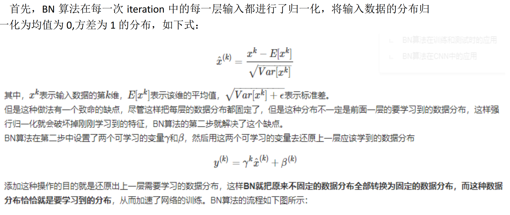

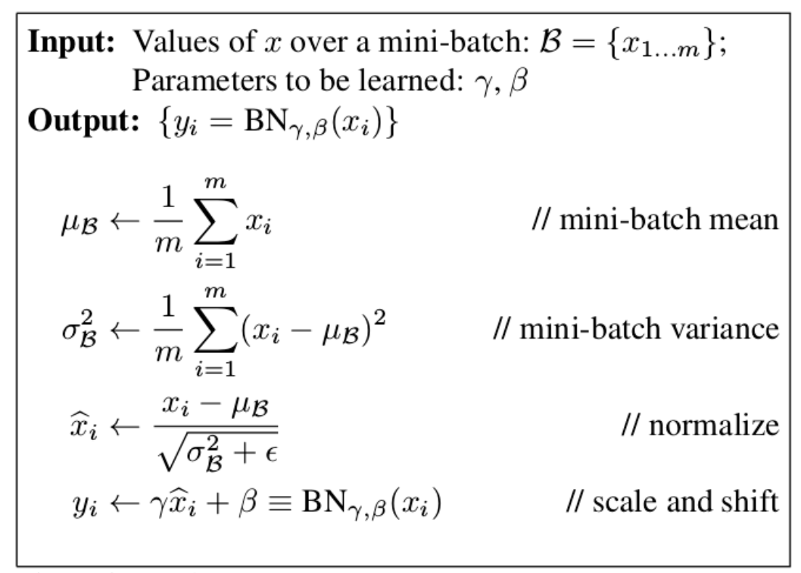

最后在全体训练集上求取均值和方差（无偏估计），去取代模型 BN 变换层的对应均值和方
差。训练完成后的均值方差还只是最后一个 banch 的均值方差，我们最后的模型是基于训练
集的，所以最后还需要增加加一步替换操作。

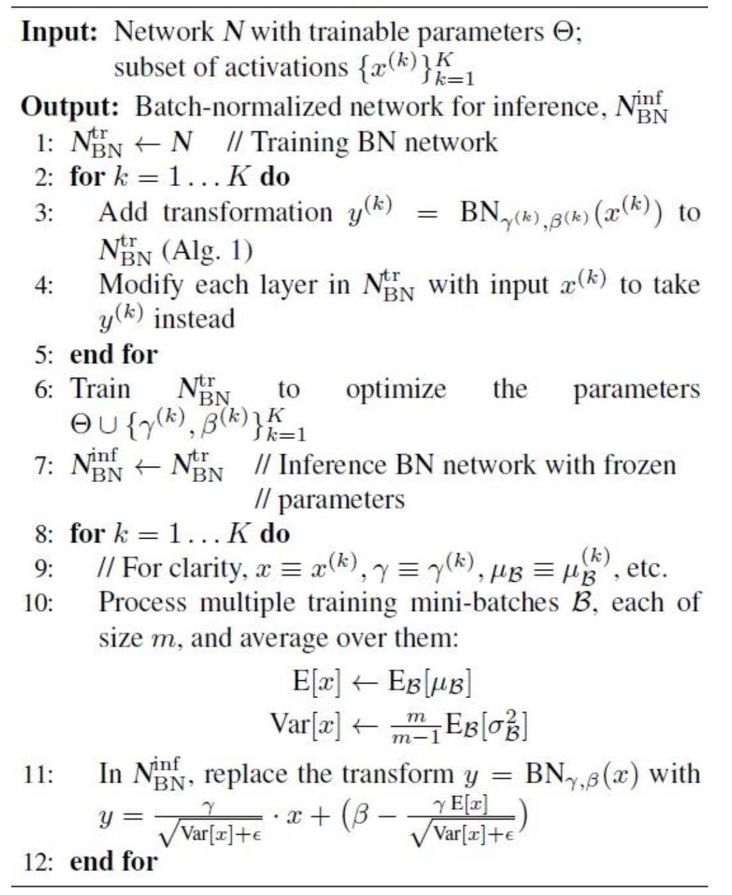

BN 的反向传播推导：

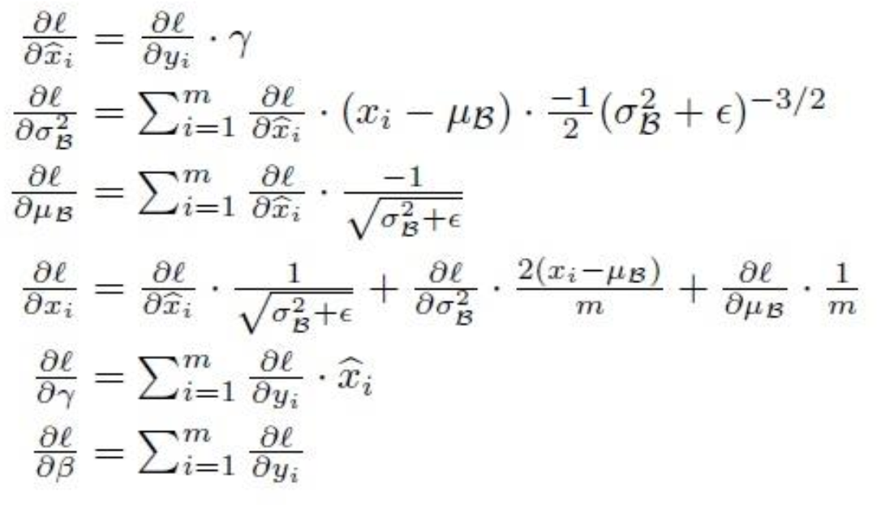

 

## 深度网络有什么好处

特征的“等级”随着网络深度的加深而变高；极其深的深度使该网络拥有极强大的表达能力

 

## 解释残差学习

深度网络容易造成梯度在 back propagation 的过程中消失，导致训练效果很差，而深度残
差网络在神经网络的结构层面解决了这一问题，使得就算网络很深，梯度也不会消失。
对于神经网络来讲，我们需要通过反向传播来对网络的权重进行调整就像这样

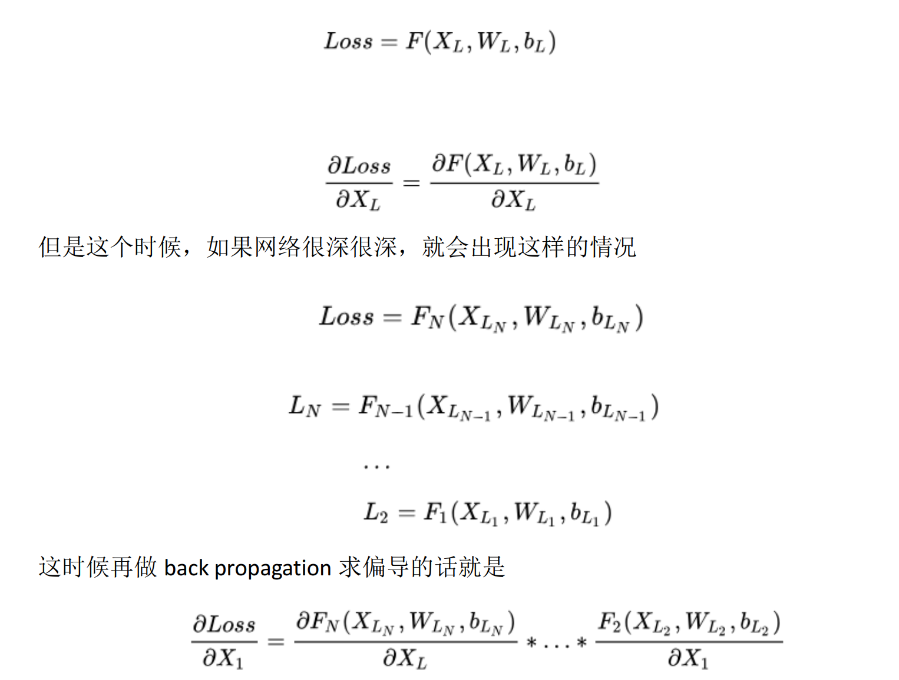

这个偏导就是我们求的 gradient，这个值本来就很小，而且再计算的时候还要再乘
stepsize，就更小了 所以通过这里可以看到，梯度在反向传播过程中的计算，如果 N 很
大，那么梯度值传播到前几层的时候就会越来越小，也就是梯度消失的问题。那 DRN 是怎
样解决这个问题的呢？它在神经网络结构的层面解决了这个问题 它将基本的单元改成了这
个样子

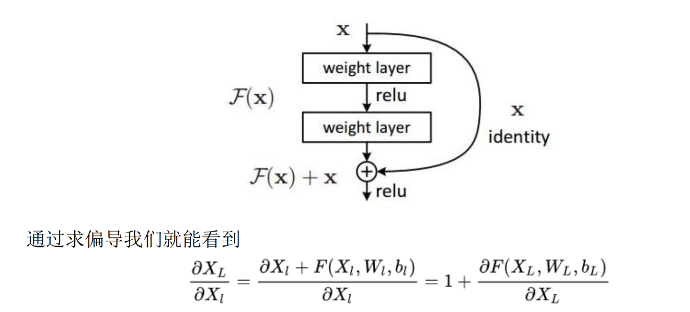

这样就算深度很深，梯度也不会消失了。当然深度残差这篇文章最后的效果好，是因为
还结合了调参数以及神经网络的其他的细节，这些也很重要，不过就不是这里我们关心的
内容了。可以看到，对于相同的数据集来讲，残差网络比同等深度的其他网络表现出了更
好的性能，收敛更快。

 

## 解释dropout

Dropout 的目的也是用来减少 overfitting（过拟合）。而和 L1， L2Regularization 不同的
是， Dropout 不是针对 cost 函数，而是改变神经网络本身的结构。假设有一个神经网络：
按照之前的方法，根据输入 X，先正向更新神经网络，得到输出值，然后反向根据backpropagation 算法来更新权重和偏向。而 Dropout 不同的是，

1） 在开始，随机删除掉隐藏层一半（一定概率） 的神经元

2）然后，在删除后的剩下一半（一定概率） 的神经元上正向和反向更新权重和偏向；

3）再恢复之前删除的神经元，再重新随机删除一半（一定概率） 的神经元，进行正向和
反向更新 w 和 b;

4）重复上述过程。

最后，学习出来的神经网络中的每个神经元都是在只有一半（一定概率） 的神经元的基础
上学习的，因为更新次数减半，那么学习的权重会偏大，所以当所有神经元被回复后（上述
步骤 2）），把得到的隐藏层的权重减半（乘以概率） 。

对于 Dropout 为什么可以减少 overfitting 的原因如下：

一般情况下，对于同一组训练数据，利用不同的神经网络训练之后，求其输出的平均值
可以减少 overfitting。 Dropout 就是利用这个原理，每次丢掉一半的一隐藏层神经元，相当
于在不同的神经网络上进行训练，这样就减少了神经元之间的依赖性，即每个神经元不能
依赖于某几个其他的神经元（指层与层之间相连接的神经元），使神经网络更加能学习到
与其他神经元之间的更加健壮 robust 的特征。在 Dropout 的作者文章中，测试手写数字的
准确率达到了 98.7%!所以 Dropout 不仅减少 overfitting，还能提高准确率

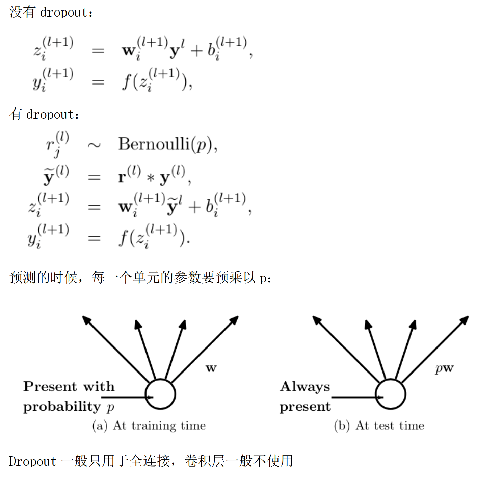

 

## softmax和sigmoid的关系和区别

softmax 是应对多分类问题， sigmoid 是应对二分类问题。 softmax 可以转换为 sigmoid。

 

## 解释deconvolution

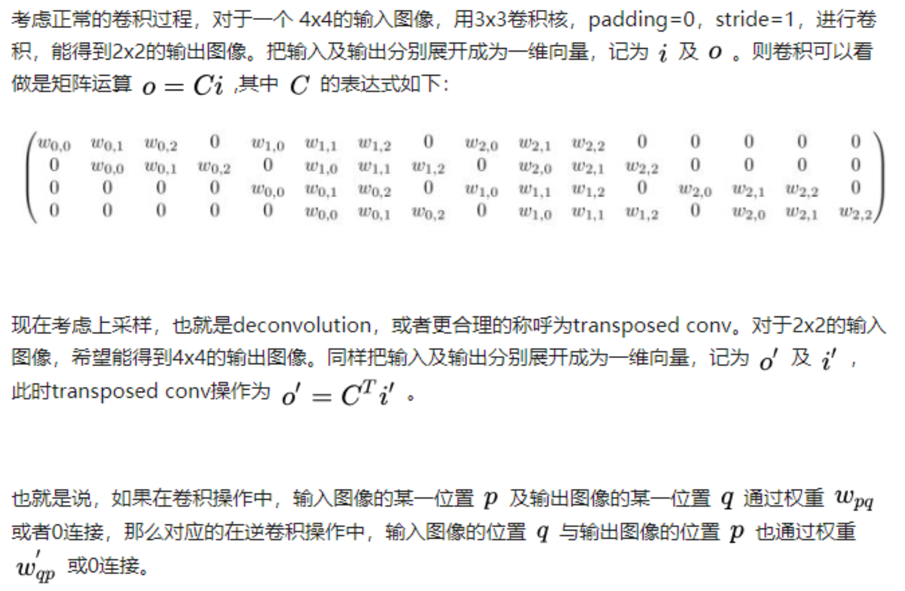

根据输出的大小和步长，卷积矩阵 C 采用不同的格式

 

## 正则化

正则化策略主要的目的是限制学习算法的能力，主要的方法可以是：限制网络模型的
神经元数量、限制模型参数（连接权重 W，偏置项 B 等）的数目、在目标函数添加一些额
外的惩罚项等。添加惩罚项可看成是对损失函数中的某些参数做一些限制，根据惩罚项的
不同可分为： L0 范数惩罚、 L1 范数惩罚（参数稀疏性惩罚）、 L2 范数惩罚（权重衰减惩
罚） 。

L0 范数是指向量中非 0 的元素的个数。

L1 正则化可以产生稀疏权值矩阵，即产生一个稀疏模型，因此可以用于特征选择

L2 正则化可以防止模型过拟合(overfitting）；

一定程度上， L1 也可以防止过拟合

Regularization 能降低 overfitting 的原因：

在神经网络中，正则化网络更倾向于小的权重，在权重小的情况下，数据随机的变化
不会对神经网络的模型造成太大的影响，所以可能性更小的受到数据局部噪音的影响。而
未加入正则化的神经网络，权重大，容易通过较大的模型改变来适应数据，更容易学习到
局部的噪音。

1.3 其它被视为正则化的策略

在深度学习中你听过的很多名词其实都是一种正则化策略，下面我们将介绍这些正则
化策略。

1.参数共享，在卷积神经网络中，卷积操作其实就采用了参数共享，通过参数共享，
减少模型参数，降低模型复杂度，从而减少模型过拟合风险，卷积神经网络的详细内容见
《卷积神经网络你需要知道的几个基本概念》。

2.噪声注入以及数据扩充，降低泛化错误率直接的方法就是训练更多的数据，但有监
督学习中，带标签的数据往往是有限的， 我们可以通过噪声注入以及数据扩充方法在现有
数据的基础上扩充数据集。

3.稀疏表征，这种正则化策略事通过某种惩罚措施来抑制神经网络隐藏层中大部分神
经元，当信息输入神经网络时，只有关键部分神经元处于激活状态。这和 1.2.2 节的 L1 范
数惩罚相似，只不过， L1 范数是使模型参数稀疏化，而表征稀疏化是隐藏层输出大多数为
零或接近零。

4.Dropout，以 dropout 概率随机断开神经元连接，是一种非常高效的深度学习正则化
措施。

 

## 感受野

定义： 感受野用来表示网络内部的不同神经元对原图像的感受范围的大小，或者说，
convNets(cnn)每一层输出的特征图(feature map)上的像素点在原始图像上映射的区域大小。

神经元之所以无法对原始图像的所有信息进行感知，是因为在这些网络结构中普遍使用卷
积层和 pooling 层，在层与层之间均为局部连接。

神经元感受野的值越大表示其能接触到的原始图像范围就越大，也意味着它可能蕴含更为
全局，语义层次更高的特征；相反，值越小则表示其所包含的特征越趋向局部和细节。因此
感受野的值可以用来大致判断每一层的抽象层次

 

## 万能近似定理

万能近似定理表明，一个前馈神经网络如果具有线性输出层和至少一层具有任何一种‘挤
压’性质的激活函数（例如 logistic sigmoid 激活函数）的隐藏层，只要给予网络足够数量的
隐藏单元，它可以以任意的精度来近似任何从一个有限维空间到另一个有限维空间的 Borel
可测函数。

万能近似定理意味着无论我们试图学习什么函数，我们知道一个大的 MLP 一定能够表示
这个函数。然而，我们不能保证训练算法能够学得这个函数。即使 MLP 能够表示该函数，
学习也可能因两个不同的原因而失败。

1、用于训练的优化算法可能找不到用于期望函数的参数值。

2、训练算法可能由于过拟合而选择了错误的函数。

 

## 什麽样的数据集不适合用深度学习

+（1）数据集太小，数据样本不足时，深度学习相对其它机器学习算法，没有明显优势。

+（2）数据集没有局部相关特性，目前深度学习表现比较好的领域主要是图像／语音／自然
语言处理等领域，这些领域的一个共性是局部相关性。图像中像素组成物体，语音信号中音
位组合成单词，文本数据中单词组合成句子，这些特征元素的组合一旦被打乱，表示的含义
同时也被改变

 

## 为什么NLP和Speech的很多问题也可以用CNN解出来

以上几个不相关问题的相关性在于，都存在局部与整体的关系，由低层次的特征经过组合，
组成高层次的特征，并且得到不同特征之间的空间相关性。

CNN 抓住此共性的手段主要有四个：局部连接／权值共享／池化操作／多层次结构。

局部连接使网络可以提取数据的局部特征；权值共享大大降低了网络的训练难度，一个
Filter 只提取一个特征，在整个图片（或者语音／文本） 中进行卷积；池化操作与多层次结
构一起，实现了数据的降维，将低层次的局部特征组合成为较高层次的特征，从而对整个图
片进行表示

 

## 什么是卷积

对图像（不同的数据窗口数据）和滤波矩阵（一组固定的权重：因为每个神经元的多个权重
固定，所以又可以看做一个恒定的滤波器 filter）做内积（逐个元素相乘再求和）的操作就是
所谓的『卷积』操作，也是卷积神经网络的名字来源。

 

## 解释DNNCNNRNN

1.多层感知机模型（DNN）：

1.1.网络结构

堆叠自编码器的网络结构本质上就是一种普通的多层神经网络结构。 就是全连接网络

1.2.模型优缺点

1.2.1.优点：

（1）、可以利用足够多的无标签数据进行模型预训练；

（2）、具有较强的数据表征能力。

1.2.2.缺点：

（1）、因为是全连接网络，需要训练的参数较多，容易出现过拟合；深度模型容易出现梯
度消散问题。

（2）、要求输入数据具有平移不变性。

2.Convolution Neural Networks 卷积神经网络

2.1.网络结构卷积神经网络是一个多层的神经网络，其基本运算单元包括：卷积运算、池化运算、全连接
运算和识别运算。

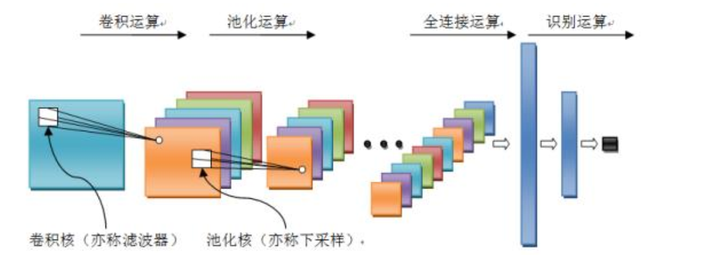

卷积运算：前一层的特征图与一个可学习的卷积核进行卷积运算，卷积的结果经过激活函数
后的输出形成这一层的神经元，从而构成该层特征图，也称特征提取层，每个神经元的输入
与前一层的局部感受野相连接，并提取该局部的特征，一旦该局部特征被提取，它与其它特
征之间的位置关系就被确定。

池化运算：它把输入信号分割成不重叠的区域，对于每个区域通过池化（下采样）运算来降
低网络的空间分辨率，比如最大值池化是选择区域内的最大值，均值池化是计算区域内的平
均值。通过该运算来消除信号的偏移和扭曲。

全连接运算：输入信号经过多次卷积核池化运算后，输出为多组信号，经过全连接运算，将
多组信号依次组合为一组信号。

识别运算：上述运算过程为特征学习运算，需在上述运算基础上根据业务需求（分类或回归
问题）增加一层网络用于分类或回归计算。

2.2.模型优缺点

2.2.1.优点：

（1）、权重共享策略减少了需要训练的参数，相同的权重可以让滤波器不受信号位置的影
响来检测信号的特性，使得训练出来的模型的泛化能力更强；

（2）、池化运算可以降低网络的空间分辨率，从而消除信号的微小偏移和扭曲，从而对输
入数据的平移不变性要求不高。

2.2.2.缺点：

（1）、深度模型容易出现梯度消散问题

3.Recurrent neural network 递归神经网络

上述模型都无法分析输入信息之间的整体逻辑序列。这些信息序列富含有大量的内容，信息
彼此间有着复杂的时间关联性，并且信息长度各种各样。这是以上模型所无法解决的，递归
神经网络正是为了解决这种序列问题应运而生，其关键之处在于当前网络的隐藏状态会保留
先前的输入信息，用来作当前网络的输出。

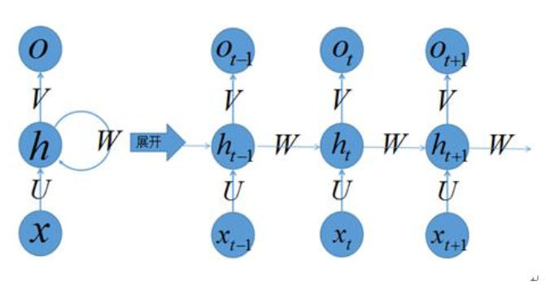

3.1.网络结构

上图左侧是递归神经网络的原始结构，如果先抛弃中间那个令人生畏的闭环，那其实就是
简单“输入层=>隐藏层=>输出层”的三层结构， 但是图中多了一个非常陌生的闭环， 也就是说
输入到隐藏层之后，隐藏层还会输入给自己，使得该网络可以拥有记忆能力。我们说递归神
经网络拥有记忆能力，而这种能力就是通过 W 将以往的输入状态进行总结，而作为下次输
入的辅助。可以这样理解隐藏状态：

h=f(现有的输入+过去记忆总结)

3.2.模型优缺点

3.2.1.优点：

（1）、模型是时间维度上的深度模型，可以对序列内容建模；

3.2.1.缺点：

（1）、需要训练的参数较多，容易出现梯度消散或梯度爆炸问题；

（2）、存在无法解决长时依赖的问题。

为解决上述问题，提出了LSTM（长短时记忆单元），通过cell门开关实现时间上的记忆功能，并防止梯度消失.

 

## depthWiseConvolution减少的计算量

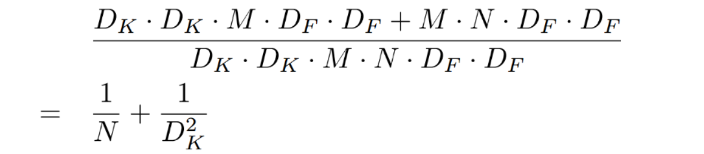

其中 DK 为标准卷积核大小， M 是输入 feature map 通道数， DF 为输出 feature map 大
小， N 是输出 feature map 通道数。

 

## 回归任务难训练

回归任务难以训练主要有两点。

一是回归任务对目标的要求比较严苛，要预测值刚好等于真实值才会使得损失函数为 0，
而分类任务则宽松得多。

二则主要是优化方面的问题，如果使用了 sigmoid/tanh 等易饱和的激活函数，在使用
softmax 等分类任务的损失函数时一定程度上可以消除这种饱和影响，而回归任务使用的损
失函数不具备这种能力。更进一步，回归任务的损失函数一般为 MSE，反向传播中求导后可
以看到梯度是与真实的 label 成正比的，所以回归任务对于数据中的 outlier 十分敏感，训
练数据中的噪声使得梯度波动很大甚至产生梯度爆炸，导致模型得不到有效训练。这是神经
网络中回归任务难以训练的一个重要原因

 

## lr和svm的异同点

1、相同点

第一， LR 和 SVM 都是分类算法。

第二，如果不考虑核函数， LR 和 SVM 都是线性分类算法，也就是说他们的分类决策面都是
线性的。

第三， LR 和 SVM 都是监督学习算法。

第四， LR 和 SVM 都是判别模型。

2、不同点

***第一***，本质上是其 loss function 不同。

不同的 loss function 代表了不同的假设前提，也就代表了不同的分类原理LR 方法基于概率理论，假设样本为 0 或者 1 的概率可以用 sigmoid 函数来表示，然后通过
极大似然估计的方法估计出参数的值，或者从信息论的角度来看，其是让模型产生的分布
P(Y|X)P(Y|X)尽可能接近训练数据的分布，相当于最小化 KL 距离【因为 KL 距离展开后，
后一项为常数，剩下的一项就是 cross entropy】。

支持向量机基于几何间隔最大化原理， 认为存在最大几何间隔的分类面为最优分类面 。

***第二***，支持向量机只考虑局部的边界线附近的点，而逻辑回归考虑全局（远离的点对边界线
的确定也起作用）。

影响 SVM 决策面的样本点只有少数的结构支持向量，当在支持向量外添加或减少任何样本
点对分类决策面没有任何影响；而在 LR 中，每个样本点都会影响决策面的结果。

***第三***，在解决非线性问题时，支持向量机采用核函数的机制，而 LR 通常不采用核函数的方
法。

在计算决策面时， SVM 算法里只有少数几个代表支持向量的样本参与了计算，也就是只有少
数几个样本需要参与核计算（即 kernal machine 解的系数是稀疏的）。然而， LR 算法里，
每个样本点都必须参与决策面的计算过程，也就是说，假设我们在 LR 里也运用核函数的原
理，那么每个样本点都必须参与核计算，这带来的计算复杂度是相当高的。所以， 在具体应
用时， LR 很少运用核函数机制。

***第四***， 线性 SVM 依赖数据表达的距离测度，所以需要对数据先做 normalization， LR 不受
其影响。

***第五***， SVM 自带结构风险最小化， LR 则是经验风险最小化
因为 SVM 本身就是优化 1/(2*||w||^2)最小化的，所以其优化的目标函数本身就含有结构风
险最小化， 所以不需要加正则项

而 LR 不加正则化的时候，其优化的目标是经验风险最小化，所以最后需要加入正则化，增
强模型的泛化能力

 

## DepthwisePointwise和group卷积的区别
***Depthwise +Pointwise*** 卷积是提供一种把 feature map 的空间信息(height＆ width）和
通道信息(channel）拆分分别处理的方法，而 group 卷积只是单纯的通道分组处理，降低
复杂度。

***Standard convolution*** ： 是采用 N 个大小为 DK*DK 的卷积核进行操作（注意卷积核大小
是 DK*DK, DK*DK*M 是具体运算时一个卷积核的大小！）

***Depth-wise convolution*** ：一个卷积核负责一个通道，一个通道只被一个卷积核卷积；则
这里有 M 个 DK*DK 的卷积核；

***Pointwise convolution***：为了达到输出 N 个 feature map 的操作，所以采用 N 个 1*1
的卷积核进行卷积，这里的卷积方式和传统的卷积方式是一样的，只不过采用了 1*1 的卷
积核；其目的就是让新的每一个 feature map 包含有上一层各个 feature map 的信息！
在此理解为将 depth-wise convolution 的输出进行「串」起来。

***group***： 设 group 为 g，那么 N 个输入 feature map 就被分成 g 个 group， M 个 filter 就被
分成 g 个 group，然后在做卷积操作的时候，第一个 group 的 M/g 个 filter 中的每一个都
和第一个 group 的 N/g 个输入 feature map 做卷积得到结果，第二个 group 同理，直到最后
一个 group。

 

## 1分析一下分类检测分割需要的特征有什么区别2用在人脸检测上的卷积和图像识别的卷积有什么区别

## 解释HoG和SIFT

1、 HOG 特征：

方向梯度直方图(Histogram of Oriented Gradient, HOG）特征是一种在计算机视觉和图
像处理中用来进行物体检测的特征描述子。它通过计算和统计图像局部区域的梯度方向直方
图来构成特征。 Hog 特征结合 SVM 分类器已经被广泛应用于图像识别中，尤其在行人检测中
获得了极大的成功。

（1）主要思想：

在一副图像中，局部目标的表象和形状(appearance and shape）能够被梯度或边缘的方向
密度分布很好地描述。（本质：梯度的统计信息，而梯度主要存在于边缘的地方）。

（2）提高性能：

把这些局部直方图在图像的更大的范围内（我们把它叫区间或 block）进行对比度归一化
（contrast-normalized），所采用的方 法是：先计算各直方图在这个区间(block）中的
密度，然后根据这个密度对区间中的各个细胞单元做归一化。通过这个归一化后，能对光照
变化和阴影获得更 好的效果。

（3）优点：
与其他的特征描述方法相比， HOG 有很多优点。首先，由于 HOG 是在图像的局部方格单元上
操作，所以它对图像几何的和光学的形变都能保持很好的不 变性，这两种形变只会出现在
更大的空间领域上。其次，在粗的空域抽样、精细的方向抽样以及较强的局部光学归一化等
条件下，只要行人大体上能够保持直立的姿 势，可以容许行人有一些细微的肢体动作，这
些细微的动作可以被忽略而不影响检测效果。因此 HOG 特征是特别适合于做图像中的人体
检测的

2、 HOG 特征提取算法的实现过程：

大概过程：

HOG 特征提取方法就是将一个 image（你要检测的目标或者扫描窗口）：

1）灰度化（将图像看做一个 x,y,z（灰度）的三维图像）；

2）采用 Gamma 校正法对输入图像进行颜色空间的标准化（归一化）；目的是调节图像的对
比度，降低图像局部的阴影和光照变化所造成的影响，同时可以抑制噪音的干扰；

3）计算图像每个像素的梯度（包括大小和方向）；主要是为了捕获轮廓信息，同时进一步
弱化光照的干扰。

4）将图像划分成小 cells（例如 6*6 像素/cell）；

5）统计每个 cell 的梯度直方图（不同梯度的个数），即可形成每个 cell 的 descriptor；

6）将每几个 cell 组成一个 block（例如 3*3 个 cell/block），一个 block 内所有 cell 的
特征 descriptor 串联起来便得到该 block 的 HOG 特征 descriptor。 每个 block 进行对比度
归一化。

7）将图像 image 内的所有 block 的 HOG 特征 descriptor 串联起来就可以得到该 image（你
要检测的目标）的 HOG 特征 descriptor 了。这个就是最终的可供分类使用的特征向量了。

***SIFT***

SIFT 算法具的特点

1. 图像的局部特征，对旋转、尺度缩放、亮度变化保持不变，对视角变化、仿射变换、
噪声也保持一定程度的稳定性。

2. 独特性好，信息量丰富，适用于海量特征库进行快速、准确的匹配。

3. 多量性，即使是很少几个物体也可以产生大量的 SIFT 特征

4. 高速性，经优化的 SIFT 匹配算法甚至可以达到实时性

5. 扩招性，可以很方便的与其他的特征向量进行联合。

1.2 SIFT 特征检测的步骤

有 4 个主要步骤

1. 尺度空间的极值检测 搜索所有尺度空间上的图像，通过高斯微分函数来识别潜在
的对尺度和选择不变的兴趣点。

2. 特征点定位 在每个候选的位置上，通过一个拟合精细模型来确定位置尺度，关键
点的选取依据他们的稳定程度。

3. 特征方向赋值 基于图像局部的梯度方向，分配给每个关键点位置一个或多个方向，
后续的所有操作都是对于关键点的方向、尺度和位置进行变换，从而提供这些特征
的不变性。

4. 特征点描述 在每个特征点周围的邻域内，在选定的尺度上测量图像的局部梯度，
这些梯度被变换成一种表示，这种表示允许比较大的局部形状的变形和光照变换

 

## 解释1RCNN2FastRCNN3FasterRCNN

***RCNN***

1. 在图像中确定约 1000-2000 个候选框 (使用选择性搜索)

2. 每个候选框内图像块缩放至相同大小，并输入到 CNN 内进行特征提取

3. 对候选框中提取出的特征，使用分类器判别是否属于一个特定类

4. 对于属于某一特征的候选框，用回归器进一步调整其位置

***Fast-RCNN***

1. 在图像中确定约 1000-2000 个候选框 (使用选择性搜索)

2. 对整张图片输进 CNN，得到 feature map

3. 找到每个候选框在 feature map 上的映射 patch，将此 patch 作为每个候选框的卷
积特征输入到 SPP layer 和之后的层

4. 对候选框中提取出的特征，使用分类器判别是否属于一个特定类

5. 对于属于某一特征的候选框，用回归器进一步调整其位置

***Faster-RCNN***

1. 对整张图片输进 CNN，得到 feature map

2. 卷积特征输入到 RPN，得到候选框的特征信息

3. 对候选框中提取出的特征，使用分类器判别是否属于一个特定类

4. 对于属于某一特征的候选框，用回归器进一步调整其位置

 

## diceloss和其导数

Intersection = dot(A, B)

Union = dot(A, A) + dot(B, B)

The Dice loss function is defined as 2 * intersection / union

The derivative is 2[(union * target - 2 * intersect * input) / union^2]

 

## 正则化惩罚为什么会起作用

L2 惩罚所基于的假设： 模型的系数们越小，则该模型越简单

（为什么简单的模型会更好呢？
根据奥卡姆剃刀原理，如果用简单的模型和复杂的模型都能同样地解释某一现象，我们更倾向于选择简单的模型来解释该现象。 ——括号里是我自己推想的）。

通过在损失函数里增加系数的二次方值，可以实现使所有的系数值都变小（当有某个系数的
值较大时，整个损失函数会变得很大，因此该损失函数不能容忍有太大值的系数）。系数值
较小的模型对外界的波动变得不那么敏感，推测这也导致了泛化能力增加。

 

## 万向节死锁

万象节锁是指物体的两个旋转轴指向同一个方向。实际上，当两个旋转轴平行时，我们就说
万向节锁现象发生了，换句话说，绕一个轴旋转可能会覆盖住另一个轴的旋转，从而失去一
维自由度。

通常说来，万向节锁发生在使用 Eular Angles（欧拉角）的旋转操作中，原因是 Eular Angles
按照一定的顺序依次独立地绕轴旋转。让我们想象一个具体的旋转场景，首先物体先绕转 X
轴旋转，然后再绕 Y 轴，最后绕 Z 轴选择，从而完成一个旋转操作，当你绕 Y 轴旋转 90 度
之后万向节锁的问题就出现了，因为 X 轴已经被求值了，它不再随同其他两个轴旋转，这样
X 轴与 Z 轴就指向同一个方向

## 最小二乘的解析解可以用Gaussian分布以及最大似然估计求得

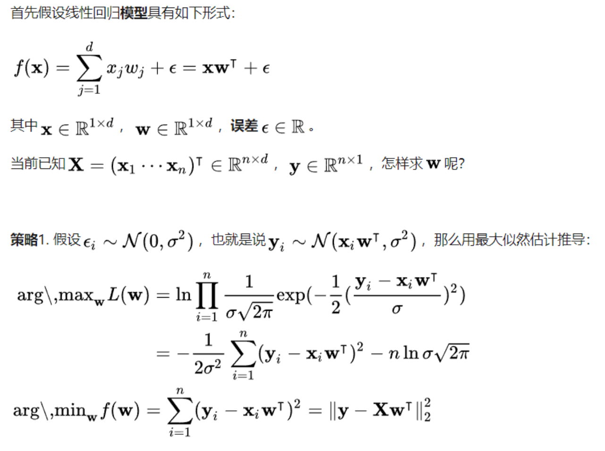

 

## 解释densenetBlock
在该网络中，任何两层之间都有直接的连接，也就是说，网络每一层的输入都是前面所有层
输出的并集，而该层所学习的特征图也会被直接传给其后面所有层作为输入。

下图是
DenseNet 的一个 dense block 示意图，一个 block 里面的结构如下，与 ResNet 中的
BottleNeck 基本一致： BN-ReLU-Conv(1×1)-BN-ReLU-Conv(3×3) （因为 BN 和 ReLU 是对
前面 concat 的卷积后的特征图进行计算的） ，而一个 DenseNet 则由多个这种 block 组成。
每 个 DenseBlock 的 之 间 层 称 为 transition layers ， 由 BN − >Conv(1 × 1)
−>averagePooling(2× 2)组成

## 解释squeezenetBlock
 
SqueezeNet 的核心在于 Fire module， Fire module 由两层构成，分别是 squeeze 层
+expand 层，如下图 1 所示， squeeze 层是一个 1*1 卷积核的卷积层， expand 层是 1*1
和 3*3 卷积核的卷积层， expand 层中，把 1*1 和 3*3 得到的 feature map 进行 concat

## 解释shufflenet

首先用带 group 的 1*1 卷积代替原来的 1*1 卷积，同时跟一个 channel shuffle 操作，。然
后是 3*3 DWConv 表示 depthwise separable convolution

***depthwise separable convolution*** 其实就是将传统的卷积操作分成两步，假设原来是 3*3
的卷积，那么 depthwise separable convolution 就是先用 M 个 3*3 卷积核一对一卷积输入
的 M 个 feature map，不求和，生成 M 个结果，然后用 N 个 1*1 的卷积核正常卷积前面生
成的 M 个结果，求和，最后得到 N 个结果

***channel shuffle***，在进行 GConv2 之前，对其输入 feature map 做一个分配，也就是每个group 分成几个 subgroup，然后将不同 group 的 subgroup 作为 GConv2 的一个 group 的
输入，使得 GConv2 的每一个 group 都能卷积输入的所有 group 的 feature map

## 梯度消失和梯度爆炸

***梯度消失***： 因为通常神经网络所用的激活函数是 sigmoid 函数，这个函数有个特点，就是能
将负无穷到正无穷的数映射到 0 和 1 之间，并且对这个函数求导的结果是 f′(x)=f(x)(1−
f(x))。

因此两个 0 到 1 之间的数相乘，得到的结果就会变得很小了。神经网络的反向传播
是逐层对函数偏导相乘，因此当神经网络层数非常深的时候，最后一层产生的偏差就因为乘
了很多的小于 1 的数而越来越小，最终就会变为 0，从而导致层数比较浅的权重没有更新，
这就是梯度消失。

***梯度爆炸***： 梯度爆炸就是由于初始化权值过大，前面层会比后面层变化的更快，就会导致权
值越来越大，梯度爆炸的现象就发生了。

在深层网络或循环神经网络中，误差梯度可在更新中累积，变成非常大的梯度，然后导致网
络权重的大幅更新，并因此使网络变得不稳定。在极端情况下，权重的值变得非常大，以至
于溢出，导致 NaN 值。

网络层之间的梯度（值大于 1.0）重复相乘导致的指数级增长会产生梯度爆炸

## Batchnorm为什么可以解决梯度的问题ReLU

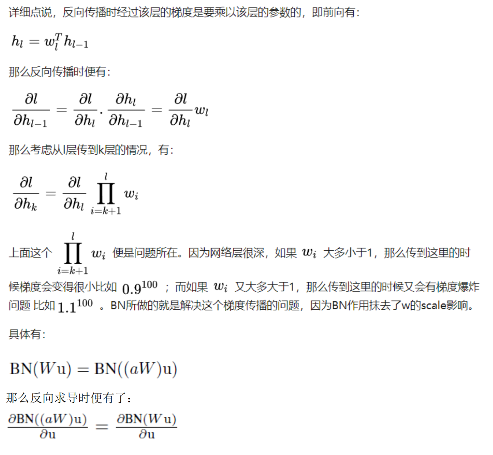

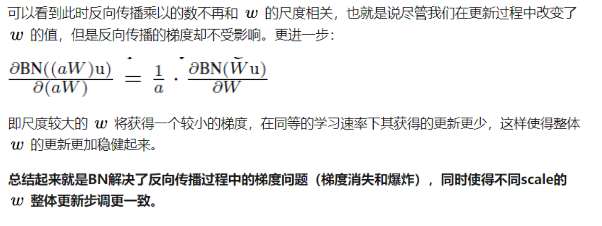

## batchnorm的思想sigmoid

因为深层神经网络在做非线性变换前的***激活输入值（就是那个 x=WU+B， U 是输入） 随着
网络深度加深或者在训练过程中，其分布逐渐发生偏移或者变动，之所以训练收敛慢，一般
是整体分布逐渐往非线性函数的取值区间的上下限两端靠近***（对于 Sigmoid 函数来说，意味
着激活输入值 WU+B 是大的负值或正值），所以***这导致反向传播时低层神经网络的梯度消失***，
***这是训练深层神经网络收敛越来越慢的本质原因***， 而 BN 就是通过一定的规范化手段，把每
层神经网络任意神经元这个输入值的分布强行***拉回到均值为 0 方差为 1 的标准正态分布***，
其实就是把越来越偏的分布强制拉回比较标准的分布，***这样使得激活输入值落在非线性函数
对输入比较敏感的区域，这样输入的小变化就会导致损失函数较大的变化***，意思是这样***让梯
度变大，避免梯度消失问题产生，而且梯度变大意味着学习收敛速度快，能大大加快训练速
度。***

***经过 BN 后，目前大部分 Activation 的值落入非线性函数的线性区内，其对应的导数
远离导数饱和区，这样来加速训练收敛过程。***

疑问：如果都通过 BN，那么不就跟把非线性函数替换成线性函数效果相同了？如果是
多层的线性函数变换其实这个深层是没有意义的，因为多层线性网络跟一层线性网络是等价
的。这意味着网络的表达能力下降了，这也意味着深度的意义就没有了。 ***所以 BN 为了保证
非线性的获得，对变换后的满足均值为 0 方差为 1 的 x 又进行了 scale 加上 shift 操作***
(y=scale*x+shift)，每个神经元增加了两个参数 scale 和 shift 参数，这两个参数是通过
训练学习到的，意思是通过 scale 和 shift 把这个值从标准正态分布左移或者右移一点并
长胖一点或者变瘦一点，每个实例挪动的程度不一样，这样等价于非线性函数的值从正中心
周围的线性区往非线性区动了动。核心思想应该是想找到一个线性和非线性的较好平衡点，
既能享受非线性的较强表达能力的好处，又避免太靠非线性区两头使得网络收敛速度太慢。

## MAE和MSE对比

MSE 对误差取了平方（令 e=真实值-预测值），因此若 e>1，则 MSE 会进一步增大误差。如
果数据中存在异常点，那么 e 值就会很大，而 e²则会远大于|e|。

因此，相对于使用 MAE 计算损失，使用 MSE 的模型会赋予异常点更大的权重。在第二个例子
中，用 RMSE 计算损失的模型会以牺牲了其他样本的误差为代价，朝着减小异常点误差的方
向更新。然而这就会降低模型的整体性能。

如果训练数据被异常点所污染，那么 MAE 损失就更好用（比如，在训练数据中存在大量错误
的反例和正例标记，但是在测试集中没有这个问题）。

直观上可以这样理解：如果我们最小化 MSE 来对所有的样本点只给出一个预测值，那么这个
值一定是所有目标值的平均值。但如果是最小化 MAE，那么这个值，则会是所有样本点目标
值的中位数。众所周知，对异常值而言，中位数比均值更加鲁棒，因此 MAE 对于异常值也比
MSE 更稳定。

然而 MAE 存在一个严重的问题（特别是对于神经网络）：更新的梯度始终相同，也就是说，
即使对于很小的损失值，梯度也很大。这样不利于模型的学习。为了解决这个缺陷，我们可
以使用变化的学习率，在损失接近最小值时降低学习率。

而 MSE 在这种情况下的表现就很好，即便使用固定的学习率也可以有效收敛。 MSE 损失的梯
度随损失增大而增大，而损失趋于 0 时则会减小。这使得在训练结束时，使用 MSE 模型的结
果会更精确

## 最大似然和损失函数

MLE 相当于找到训练数据集似然度（或等效对数似然度）最大时的参数θ。更具体的来
说，下图的表述得到了最大化:

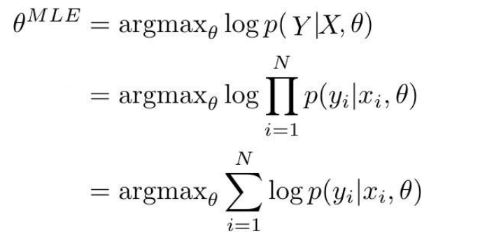

当 p(Y|X,θ )由模型确定时，它表示了训练数据中真实标签的概率。如果 p(Y|X,θ ) 接
近于 1，这意味着模型能够确定训练集中正确的标签/均值。在给定由 N 个观察对组成的训
练数据(X,Y）的条件下，训练数据的似然度可被改写成对数概率的总和。

在分类与回归的情况下， p(y|x,θ )作为一个(x,y）的后验概率，可以被改写成范畴分
布和高斯分布。在优化神经网络的情况下，目标则是去改变参数，具体方式是：对于一系列
输入 X，概率分布 Y 的正确的参数可以在输出（回归值或类）中得到。一般这可以通过
梯度下降和其变体来实现。因此，为了得到一个 MLE 估计，我们的目标是优化关于真实
输出的模型输出：

• 最大化一个范畴分布的对数值相当于最小化真实分布与其近似分布的交叉熵。

• 最大化高斯分布的对数值相当于最小化真实均值与其近似均值的均方差。

## 过拟合的两种解释

1、训练集过拟合。指训练准确率和测试准确率之间的差异。

2、测试集过拟合。过拟合的另一个概念是测试准确率和潜在数据分布准确率之间的差距。
通过使模型设计选择适应测试集，可能会隐性地使模型适应测试，测试准确率随后失去了对
真正为见过数据准确性进行测量的有效性。（也就是经验风险估计期望风险的不确定性）

## 回归和高斯分布

回归模型的输出与一个著名的概率分布有关：高斯分布。事实证明，判别式回归模型的输出
代表了一个高斯分布的均值（一个高斯分布完全由一个均值与标准差决定）

## 最大似然估计和网络训练

softmax 虽然是基于 multinoulli 分布，但是每次对测试样本进行预测的时候，输出的值是
各个类的概率分布，即 P(c|x)，但是该概率和我们基于的分布概率是不一样的。 分布概率
是通过求期望来评估的。

最大似然估计是是找到能最大化模型产生真实观察数据可能性的那一组参数。 不管是分类还
是回归，每个样本的输出都是模型对该样本的单独计算结果，是该样本的后验概率。对于类
别 a，所有被判断为 a 的样本的后验概率加一起可以得到该类别的先验概率。模型的损失函
数都是基于最大似然估计，分类和回归的模型输出都输出的是模型该样本的所有类别的后验
概率分布，回归之所以是一个值，是因为对高斯分布建模，直接选择均值作为输出，因为高
斯分布的均值的概率是最高的

## 线性回归和高斯分布

当噪声符合正态分布 N(0,delta^2)时，因变量则符合正态分布 N(ax(i)+b,delta^2)，其中
预测函数 y=ax(i)+b。这个结论可以由正态分布的概率密度函数得到。也就是说当噪声符合
正态分布时，其因变量必然也符合正态分布。

在用线性回归模型拟合数据之前，首先要求数据应符合或近似符合正态分布，否则得到的拟
合函数不正确。

若本身样本不符合正态分布或不近似服从正态分布，则要采用其他的拟合方法，比如对于服
从二项式分布的样本数据，可以采用 logistics 线性回归。

残差 e 服从正态分布 N(0,σ 2) 。其方差σ 2 = var (ei) 反映了回归模型的精度， σ 越
小，用所得到回归模型预测 y 的较精确度愈高。

说判别式回归模型只有一个输出其实会让人误解，实际上，一个回归模型的输出与一个著名
的概率分布有关：高斯分布。事实证明， 判别式回归模型的输出代表了一个高斯分布的均值
（一个高斯分布完全由一个均值与标准差决定）

## 解释知识蒸馏

1、训练大模型：先用 hard target，也就是正常的 label 训练大模型。

2、计算 soft target：利用训练好的大模型来计算 soft target。也就是大模型“ 软化后”
再经过 softmax 的 output。

3、训练小模型，在小模型的基础上再加一个额外的 soft target 的 loss function，通过
lambda 来调节两个 loss functions 的比重。

4、预测时，将训练好的小模型按常规方式（右图）使用。

为什么有用？

Knowledge Distill 是一种简单弥补分类问题监督信号不足的办法。

传统的分类问题，模型的目标是将输入的特征映射到输出空间的一个点上，例如在著名
的 Imagenet 比赛中，就是要将所有可能的输入图片映射到输出空间的 1000 个点上。这么做
的话这 1000 个点中的每一个点是一个 one hot 编码的类别信息。这样一个 label 能提供的
监督信息只有 log(class)这么多 bit。然而在 KD 中，我们可以使用 teacher model 对于每
个样本输出一个连续的 label 分布，这样可以利用的监督信息就远比 one hot 的多了。

另外一个角度的理解，大家可以想象如果只有 label 这样的一个目标的话，那么这个模型的目标就是把训练样本中每一类的样本强制映射到同一个点上，这样其实对于训练很有帮
助的类内 variance 和类间 distance 就损失掉了。然而使用 teacher model 的输出可以恢
复出这方面的信息。具体的举例就像是 paper 中讲的， 猫和狗的距离比猫和桌子要近，同
时如果一个动物确实长得像猫又像狗，那么它是可以给两类都提供监督。

综上所述， KD 的核心思想在于"打散"原来压缩到了一个点的监督信息，让 student 模
型的输出尽量 match teacher 模型的输出分布。 其实要达到这个目标其实不一定使用
teacher model，在数据标注或者采集的时候本身保留的不确定信息也可以帮助模型的训练。
当然 KD 本身还有很多局限，比如当类别少的时候效果就不太显著，对于非分类问题也不适
用。

## 一般激活函数有如下一些性质

1. 非线性： 当激活函数是线性的，一个两层的神经网络就可以基本上逼近所有的函数。但
如果激活函数是恒等激活函数的时候，即 f(x)=x，就不满足这个性质，而且如果 MLP 使
用的是恒等激活函数，那么其实整个网络跟单层神经网络是等价的；

2. 可微性： 当优化方法是基于梯度的时候，就体现了该性质；

3. 单调性： 当激活函数是单调的时候，单层网络能够保证是凸函数；

4. f(x)≈x： 当激活函数满足这个性质的时候，如果参数的初始化是随机的较小值，那么
神经网络的训练将会很高效；如果不满足这个性质，那么就需要详细地去设置初始值；

5. 输出值的范围： 当激活函数输出值是有限的时候，基于梯度的优化方法会更加稳定，因
为特征的表示受有限权值的影响更显著；当激活函数的输出是无限的时候，模型的训练
会更加高效，不过在这种情况小，一般需要更小的 Learning Rate。

## relu的缺点

1、 ReLU 的输出不是 zero-centered

2、 Dead ReLU Problem，指的是某些神经元可能永远不会被激活，导致相应的参数永远不能
被更新。有两个主要原因可能导致这种情况产生: 

(1) 非常不幸的参数初始化，这种情况比较少见 

(2) learning rate 太高导致在训练过程中参数更新太大，不幸使网络进入这种状
态。解决方法是可以采用 Xavier 初始化方法，以及避免将 learning rate 设置太大或使用
adagrad 等自动调节 learning rate 的算法。

## densenet缺点

更少的参数量并不意味着更节约显存或训练每一步会更快。因为有稠密直连的过程，所以各
个 feature 都要存下来，实际上很容易爆显存，另外，这种稠密连接也意味着反向传播计算
梯度更加复杂，每一步训练并不一定会更快。

## 凸优化问题OPT的定义

凸优化就是： 

1、在最小化（最大化）的要求下，

2、目标函数是一个凸函数（凹函数），

3、同时约束条件所形成的可行域集合是一个凸集。

凸优化中局部最优是全局最优

凸函数是一个定义在某个向量空间的凸子集 C（区间）上的实值函数 f，而且对于凸子
集 C 中任意两个向量 x1,x2, f((x1+x2)/2)<=(f(x1)+f(x2))/2,则 f(x)是定义在凸子集 c
中的凸函数

## 解释adam优化

Adam 优化器，结合 AdaGrad 和 RMSProp 两种优化算法的优点。对梯度的一阶矩估计(First
Moment Estimation，即梯度的均值）和二阶矩估计(Second Moment Estimation，即梯度
的未中心化的方差）进行综合考虑，计算出更新步长。

二阶矩： 梯度平方累积和的平方根（时间上） 。此项能够累积各个参数 gt,i 的历史梯度平
方，频繁更新的梯度，则累积的分母项逐渐偏大，那么更新的步长(stepsize)相对就会变小，
而稀疏的梯度，则导致累积的分母项中对应值比较小，那么更新的步长则相对比较大。

## batchnorm细节

BN 层是对于每个神经元做归一化处理，甚至只需要对某一个神经元进行归一化，而不是
对一整层网络的神经元进行归一化。既然 BN 是对单个神经元的运算，那么在 CNN 中卷积层
上要怎么搞？假如某一层卷积层有 6 个特征图，每个特征图的大小是 100*100，这样就相当
于这一层网络有 6*100*100 个神经元，如果采用 BN，就会有 6*100*100 个参数 γ 、 β ，这
样岂不是太恐怖了。因此卷积层上的 BN 使用，其实也是使用了类似权值共享的策略，把一
整张特征图当做一个神经元进行处理。

卷积神经网络经过卷积后得到的是一系列的特征图，如果 min-batch sizes 为 m，那么网
络某一层输入数据可以表示为四维矩阵(m,f,w,h)， m 为 min-batch sizes， f 为特征图个数，
w、 h 分别为特征图的宽高。在 CNN 中我们可以把每个特征图看成是一个特征处理（一个神
经元），因此在使用 Batch Normalization， mini-batch size 的大小就是： m*w*h，于是
对于每个特征图都只有一对可学习参数： γ 、 β 。说白了吧，这就是相当于求取所有样本所
对应的一个特征图的所有神经元的平均值、方差，然后对这个特征图神经元做归一化。

## BatchNormalization的优点

(1）可以使用更高的学习率， BN 有快速收敛的特性。在没有加 Batch Normalization 的网
络中我们要慢慢的调整学习率时，甚至在网络训练到一半的时候，还需要想着学习率进一步
调小的比例选择多少比较合适。现在，我们在网络中加入 Batch Normalization 时，可以采
用初始化很大的学习率，然后学习率衰减速度也很大，因此这个算法收敛很快。

(2）模型中 BN 可以代替 dropout 或者使用较低的 dropout。 dropout 是经常用来防止过拟
合的方法，但是模型中加入 BN 减少 dropout，可以大大提高模型训练速度，提高网络泛化
性能。

(3）减少 L2 权重衰减系数。用了 Batch Normalization 后，可以把 L2 权重衰减系数降低，
论文中降低为原来的 5 倍。

(4）取消 Loacl Response Normalization 层。（局部响应归一化是 Alexnet 网络用到的方
法），因为 BN 本身就是一个归一化网络层。

(5） BN 本质上解决了反向传播过程中梯度消失的问题。 BN 算法对 Sigmoid 激活函数的提升
非常明显，解决了困扰学术界十几年的 sigmoid 过饱和造成梯度消失的问题。在深度神经网
络中，靠近输入的网络层在梯度下降的时候，得到梯度值太小，导致深层神经网络只有靠近
输出层的那几层网络在学习。因为数据使用 BN 后，归一化的数据仅使用了 sigmoid 线性的
部分。

(6）可以把训练数据彻底打乱。防止了每批训练的时候，某一个样本经常被挑选到。论文
中指出这个操作可以提高 1%的精度。

## 为什么不使用全局平均值

因为无法得到，计算量太大，只能使用移动平均值。

***平均值***

训练阶段是每个 batch 的平均值

测试阶段是采用移动平均值，移动平均值是在训练阶段不断更新的

***为什么最后需要移动平均？***

首先是希望输出只依赖于输入，其次测试的时候没有 batch，所以采用全局均值和方差。

***BN 为什么能防止过拟合***

BN 的归一化取决 batch 中的数据，所以相当于做了数据增强。

***BN 的后两个参数***

是网络通过梯度下降来学习的

***BN 的移动平均值计算公式***

mean = 0.1 * 当前 mean + 0.9 * 以前的 mean

## 线性回归的随机误差正态分布假设

经典正态线性回归假设每个随机误差项 ui 都是正态分布的，且均值为 0，方差齐性，协方
差为 0（不相关且独立分布）。

正态性假设的理由：

独立同分布的随机变量，当个数无限增大时，其总和将趋于正态分布-中心极限定理；

正态分布的一个性质是，正态分布变量的任何线性函数都是正态分布的。这样在 ui 的正
态假设下，回归参数的估计量都是正态分布的。

## 优化器的自适应解释

这里的自适应是针对不同的参数，自适应的调整学习率，有的参数更新次数较多，学习率就
不断降低，更新次数少的参数，则学习率保持较大。

## 池化的作用

1 其中一个显而易见， 就是减少参数。通过对 Feature Map 降维，有效减少后续层需要的
参数

2 另一个则是 Translation Invariance。它表示对于 Input，当其中像素在邻域发生微小
位移时， Pooling Layer 的输出是不变的。这就使网络的鲁棒性增强了，有一定抗扰动的作
用（平移不变性）

根据相关理论，特征提取的误差主要来自两个方面：

（ 1）邻域大小受限造成的估计值方差增大；

（ 2）卷积层参数误差造成估计均值的偏移。

一般来说， mean-pooling 能减小第一种误差，更多的保留图像的背景信息， max-pooling 能
减小第二种误差，更多的保留纹理信息。

## 参数估计的频率派和贝叶斯派
频率主义学派认为参数虽然未知，但却是客观存在的固定值，因此，可通过优化似然函数等
准则来确定参数值。

贝叶斯学派认为参数是未观察到的随机变量，其本身也可有分布，因此，可假定参数服从一个先验分布，然后基于观测到的数据来计算参数的后验分布。

## 1卷积核如何进行权值共享的2大的卷积核和小的卷积核相比有什么优缺点3为什么现在基本不用大卷积核

在达到相同感受野的情况下，卷积核越小，所需要的参数和计算量越小。

具体来说。卷积核大小必须大于 1 才有提升感受野的作用， 1 排除了。而大小为偶数的
卷积核即使对称地加 padding 也不能保证输入 feature map 尺寸和输出 feature map 尺寸
不变（画个图算一下就可以发现）， 2 排除了。所以一般都用 3 作为卷积核大小。

## 雅可比矩阵和海塞矩阵

雅可比矩阵是一阶偏导数以一定方式排列成的矩阵。

海森矩阵(Hessian matrix 或 Hessian)是一个自变量为向量的实值函数的二阶偏导数组成
的方块矩阵。

## 1x1卷积的作用

1、 在相同尺寸的感受野中叠加更多的卷积，能提取到更丰富的特征。 （ NIN）

2、 用来降维和升维，从而降低计算量

## 牛顿法和梯度下降对比

1. 牛顿法起始点不能离局部极小点太远，否则很可能不会收敛。 (考虑到二阶拟合应该很容
易想象)，所以实际操作中会先使用别的方法，比如梯度下降法，使更新的点离最优点比较
近，再开始用牛顿法。

2. 牛顿法每次需要更新一个二阶矩阵，当维数增加的时候是非常耗内存的，所以实际使用
是会用拟牛顿法。

3. 梯度下降法在非常靠近最优点时会有震荡，就是说明明离的很近了，却很难到达，因为
线性的逼近非常容易一个方向过去就过了最优点(因为只能是负梯度方向)。但牛顿法因为是
二次收敛就很容易到达了。

牛顿法最明显快的特点是对于二阶函数(考虑多元函数的话要在凸函数的情况下)，牛顿法能
够一步到达，非常有效

## 为什么多采用正态分布

1、我们想要建模的很多分布的真实情况是比较接近正态分布的。中心极限定理说明很多独
立随机变量的和近似服从正态分布。这意味着在实际中，很多复杂系统都可以被成功地建模
成正态分布的噪声，即使系统可以被分解成一些更结构化的部分。

2、在具有相同方差的所有可能的概率分布中，正态分布在实数上具有最大的不确定性。因
此，我们可以认为正态分布式对模型加入的先验知识量最少的分布

## FCN第一个卷积层为什么要padding100

因为如果不 padding100，由于池化的原因会导致长宽小于 192 的图片无法计算，而
padding100 后，则无论多大的图像都可以进行计算。

## 分割网络计算softmax

分割网络计算 softmax 是多个通道间，对应位置的像素点做 softmax，所以是像素级分类问
题 

## inception的作用

inception 结构的主要贡献有两个：一是使用 1x1 的卷积来进行升降维；二是在多个尺寸上
同时进行卷积再聚合。

解释：

***解释 1***： 在直观感觉上在多个尺度上同时进行卷积，能提取到不同尺度的特征。特征更为丰
富也意味着最后分类判断时更加准确。

***解释 2***： 利用稀疏矩阵分解成密集矩阵计算的原理来加快收敛速度。

***解释 3***： Hebbin 赫布原理。 Hebbin 原理是神经科学上的一个理论，解释了在学习的过程中
脑中的神经元所发生的变化，用一句话概括就是 fire togethter, wire together。赫布认
为“ 两个神经元或者神经元系统，如果总是同时兴奋，就会形成一种‘ 组合’ ，其中一个神
经元的兴奋会促进另一个的兴奋” 。用在 inception 结构中就是要把相关性强的特征汇聚
到一起。这有点类似上面的解释 2，把 1x1， 3x3， 5x5 的特征分开。因为训练收敛的最终目
的就是要提取出独立的特征，所以预先把相关性强的特征汇聚，就能起到加速收敛的作用。

## Googlenet的特点

1、 inception

2、多个 loss： Inception Net 有 22 层深，除了最后一层的输出，***其中间节点的分类效果
也很好。因此在 Inception Net 中，还使用到了辅助分类节点，即将中间某一层的输出用作
分类，并按一个较小的权重（ 0.3）加到最终分类结果中。这样相当于做了模型融合***，同时
给网络增加了反向传播的梯度信号，也提供了额外的正则化，对于整个 Inception Net 的训
练很有裨益。 （缓解梯度消失）

## VGG的特点

卷积层使用更小的 filter 尺寸和间隔

3×3 卷积核的优点：

1、 多个 3×3 的卷基层比一个大尺寸 filter 卷基层有更多的非线性，使得判决函数更加具
有判决性

2、 多个 3×3 的卷积层比一个大尺寸的 filter 有更少的参数，假设卷基层的输入和输出的
特征图大小相同为 C，那么三个 3×3 的卷积层参数个数 3×（ 3×3×C×C） =27CC；一个 7×7
的卷积层参数为 49CC；所以可以把三个 3×3 的 filter 看成是一个 7×7filter 的分解（中
间层有非线性的分解）

1*1 卷积核的优点：

作用是在不影响输入输出维数的情况下，对输入进行线性形变，然后通过 Relu 进行非
线性处理，增加网络的非线性表达能力。

## 稀疏性大概有以下三方面的贡献

1.1 信息解离

当前，深度学习一个明确的目标是从数据变量中解离出关键因子。原始数据（以自然数据为
主）中通常缠绕着高度密集的特征。原因是这些特征向量是相互关联的，一个小小的关键因
子可能牵扰着一堆特征，有点像蝴蝶效应，牵一发而动全身。基于数学原理的传统机器学习手段在解离这些关联特征方面具有致命弱点。然而，如果能够解开特征间缠绕的复杂关系，
转换为稀疏特征，那么特征就有了鲁棒性（去掉了无关的噪声）。

1.2 线性可分性

稀疏特征有更大可能线性可分，或者对非线性映射机制有更小的依赖。因为稀疏特征处于高
维的特征空间上（被自动映射了）从流形学习观点来看（参见降噪自动编码器），稀疏特征
被移到了一个较为纯净的低维流形面上。线性可分性亦可参照天然稀疏的文本型数据，即便
没有隐层结构，仍然可以被分离的很好。

1.3 稠密分布但是稀疏

稠密缠绕分布着的特征是信息最富集的特征，从潜在性角度，往往比局部少数点携带的特征
成倍的有效。而稀疏特征，正是从稠密缠绕区解离出来的，潜在价值巨大。

1.4 稀疏性激活函数的贡献的作用：

不同的输入可能包含着大小不同关键特征，使用大小可变的数据结构去做容器，则更加灵活。
假如神经元激活具有稀疏性，那么不同激活路径上：不同数量（选择性不激活）、不同功能
（分布式激活），两种可优化的结构生成的激活路径，可以更好地从有效的数据的维度上，
学习到相对稀疏的特征，起到自动化解离效果。

## GBDT和xgboost

GBDT 主要思想就是 boost（ 加性集成） +前后分布算法（拟合残差学习一个回归树，更新模
型）

xgboost 是 GBDT 的高校实现，加入了正则化，以及使用贪心算法来选择分割点，借鉴随机
森林，加入列抽样（降维，或者属性筛选）

## 1PR曲线2ROC曲线3AUC

***P-R 曲线***：

查准率为纵轴，查全率为横轴

查准率:P=TP/(TP+FP)

查全率:R=TP/(TP+FN)

***ROC 曲线***：

纵轴真正例率(TPR)，横轴假正例率(FPR)

真正例率:TPR=TP/(TP+FN)

假正例率:FPR=FP/(TN+FP)

***AUC***： ROC 曲线下的面积

## 人脸姿态网络输入一张白纸的结果是

三个角度都是比较小的角度。

## shufflenetV2

提出了设计高效网络架构需要遵循的准则：

• G1. 相同的通道宽度可最小化内存访问成本（ MAC）；

• G2. 过度的组卷积会增加 MAC；

• G3. 网络碎片化（例如 GoogLeNet 的多路径结构）会降低并行度；

• G4. 元素级运算不可忽视。

网络结构：

引入一个简单的操作——通道分割（ channel split）。在每个单元的开始， c 特征通道的
输入被分为两支，分别带有 c−c' 和 c'个通道。按照准则 G3，一个分支仍然保持不变。
另一个分支由三个卷积组成，为满足 G1，令输入和输出通道相同。与 ShuffleNet V1 不同
的是，两个 1× 1 卷积不再是组卷积。这部分是为了遵循 G2，部分是因为分割操作已经产
生了两个组。

卷积之后，把两个分支拼接（ concat） 起来，从而通道数量保持不变 (G1)。 然后进行与
ShuffleNet V1 相同的「 Channel Shuffle」 操作来保证两个分支间能进行信息交流

## 分割中池化问题的解决方法

池化层不仅能增大上层卷积核的感受野，而且能聚合背景同时丢弃部分位置信息。然而，语
义分割方法需对类别图谱进行精确调整，因此需要保留池化层中所舍弃的位置信息。
有两个不同形式的结构可以解决这个问题。

第一种方法是编码器-解码器结构。

其中，编码器使用池化层逐渐缩减输入数据的空间维度，
而解码器通过反卷积层逐步恢复目标的细节和相应的空间维度。从编码器到解码器之间，通
常存在直接的信息连接，来帮助解码器更好地恢复目标细节。典型结构： Unet 网络。

第二种方法使用了称作空洞卷积的结构，且去除了池化层结构。

空洞卷积（或者扩张卷积）是具有一个因子的常规卷积，这个因子使得我们能够扩展滤波器
的视野。以 3×3 卷积滤波器为例。当扩张因子等于 1 时，它的行为类似于标准卷积。但
是，如果将扩张因子设置为 2，则它具有扩大卷积核的效果。理论上，它是这样工作的：首
先，根据扩张率对卷积滤波器进行扩张。然后，它用零填充空白空间，创建稀疏的类似滤波
器。最后，使用扩张的滤波器进行常规卷积

## 1知识蒸馏T参数是什么2有什么作用

T 参数为了对应蒸馏的概念，在论文中叫的是 Temperature，也就是蒸馏的温度。 T 越高
对应的分布概率越平缓，为什么要使得分布概率变平缓？举一个例子，假设你是每次都是进
行负重登山，虽然过程很辛苦，但是当有一天你取下负重，正常的登山的时候，你就会变得
非常轻松，可以比别人登得高登得远。

同样的，在这篇文章里面的 T 就是这个负重包，我们知道对于一个复杂网络来说往往能够
得到很好的分类效果，错误的概率比正确的概率会小很多很多，但是对于一个小网络来说它
是无法学成这个效果的。我们为了去帮助小网络进行学习，就在小网络的 softmax 加一个 T
参数，加上这个 T 参数以后错误分类再经过 softmax 以后输出会变大（ softmax 中指数函数
的单增特性，这里不做具体解释），同样的正确分类会变小。这就人为的加大了训练的难度，
一旦将 T 重新设置为 1，分类结果会非常的接近于大网络的分类效果。

 

* **二.搜索广告推荐算法**

## a

a

 

* **三.计算机基础**

## 红黑二叉树的性质

1.每个节点不是红色就是黑色的；

2.根节点总是黑色的；

3.如果节点是红色的，则它的子节点必须是黑色的（反之不一定）；

4.从根节点到叶节点或空子节点的每条路径，必须包含相同数目的黑色节点（即相同的黑色
高度）。

## 同步和异步

同步是指：当程序 1 调用程序 2 时，程序 1 停下不动，直到程序 2 完成回到程序 1 来，程序
1 才继续执行下去。

异步是指：当程序 1 调用程序 2 时，程序 1 径自继续自己的下一个动作，不受程序 2 的的影
响。

同步是指：发送方发出数据后，等接收方发回响应以后才发下一个数据包的通讯方式。

异步是指：发送方发出数据后，不等接收方发回响应，接着发送下个数据包的通讯方式。

同步和异步的区别

举个例子：普通 B/S 模式（同步） AJAX 技术（异步）

同步：提交请求->等待服务器处理->处理完毕返回 这个期间客户端浏览器不能干任何事

异步: 请求通过事件触发->服务器处理（这是浏览器仍然可以作其他事情） ->处理完毕

* **四.编程基础**

## CCpp程序编译的内存分配情况有哪几种并简要解释

一、从静态存储区域分配：
内存在程序编译时就已经分配好，这块内存在程序的整个运行期间都存在。速度快，不容
易出错，因为有系统会善后。例如全局变量， static 变量等。

二、在栈上分配：
在执行函数时,函数内局部变量的存储单元都在栈上创建，函数执行结束时这些存储单元
自动被释放。栈内存分配运算内置于处理器的指令集中，效率很高，但是分配的内存容量有
限。

三、从堆上分配：
即动态内存分配。程序在运行的时候用 malloc 或 new 申请任意大小的内存，程序员自己
负责在何时用 free 或 delete 释放内存。动态内存的生存期由程序员决定，使用非常灵活。
如果在堆上分配了空间,就有责任回收它，否则运行的程序会出现内存泄漏，另外频繁地分
配和释放不同大小的堆空间将会产生堆内碎块。

 

## python生成器迭代器装饰器

***生成器***:

要理解 generator 的工作原理，它是在 for 循环的过程中不断计算出下一个元素，并在适
当的条件结束 for 循环。对于函数改成的 generator 来说，遇到 return 语句或者执行到函
数体最后一行语句，就是结束 generator 的指令， for 循环随之结束。 定义 generator 是在
函数中加入 yield， 在每次调用 next()的时候执行，遇到 yield 语句返回，再次执行时从上
次返回的 yield 语句处继续执行。

***迭代器***:

Python 的 Iterator 对象表示的是一个数据流， Iterator 对象可以被 next()函数调用并
不断返回下一个数据，直到没有数据时抛出 StopIteration 错误。可以把这个数据流看做是
一个有序序列，但我们却不能提前知道序列的长度，只能不断通过 next()函数实现按需计
算下一个数据，所以 Iterator 的计算是惰性的，只有在需要返回下一个数据时它才会计算。
生成器都是 Iterator 对象，但 list、 dict、 str 虽然是 Iterable，却不是 Iterator。
把 list、 dict、 str 等 Iterable 变成 Iterator 可以使用 iter()函数：

***装饰器***:

在代码运行期间动态增加功能的方式，称之为“装饰器”(Decorator）。本质上， decorator
就是一个返回函数的高阶函数

 

## 静态语音和动态语言

1.静态语言（强类型语言）

静态语言是在编译时变量的数据类型即可确定的语言，多数静态类型语言要求在使用变量之
前必须声明数据类型。

例如： C++、 Java、 Delphi、 C#等。

2.动态语言（弱类型语言）

动态语言是在运行时确定数据类型的语言。变量使用之前不需要类型声明，通常变量的类型
是被赋值的那个值的类型。

例如 PHP/ASP/Ruby/Python/Perl/ABAP/SQL/JavaScript/Unix Shell 等等。

 

## Cpp模板

一个模板就是一个编译器用来生成特定类类型或函数的蓝图。生成特定类或函数的过程称
为实例化。我们只编写一次模板，就可以将其用于多种类型和值，编译器会为每种类型和值
进行模板实例化。

我们既可以定义函数模板，也可以定义类模板。标准库算法都是函数模板，标准库容器都
是模板类。

函数模板

template <class type> ret-type func-name(parameter list) { // 函数的主体 }

类模板

template <class type> class class-name {
}

## const指针和指针const

const int * pOne; //指向整形常量 的指针，它指向的值不能修改

int * const pTwo; //指向整形的常量指针 ，它不能在指向别的变量，但指向（变
量）的值可以修改。

## new/malloc以及free/delete之间的区别

a.new/delete 是运算符,只能在 C++中使用,它可以重载;mallloc/free 是 C 的标准库函数,
在 C/C++中都可以使用.

b.对于非内部的数据类型的对象而言,光用 malloc/free 是无法满足动态对象的要求的.对
象在创建的时候需要执行构造函数,对象在消亡之前需要执行析构函数.而 molloc/free 是
库函数而不是运算符,不在编译器的控制范围之内,编译器不能将执行构造函数和析构函数
的任务强加给 malloc/free.因此 C++需要一个能够完成动态分配内存和初始化的 new,以及
一个能够完成清理和释放内存的运算符 delete.

c.new 的返回值是指定类型的指针,可以自动的计算所需要分配的内存大小.而 malloc 的返
回值是一个 void 类型的指针,我们在使用的时候要进行强制类型转换,并且分配的大小也要
程序员手动的计算.

d.new/delete 完全覆盖了 malloc/free 的功能,只所以还要保留 malloc/free,是因为我们
的 C++程序有时要调用用 C 编写的， 而 C 中又没有 new/delete,只能使用 malloc/free

